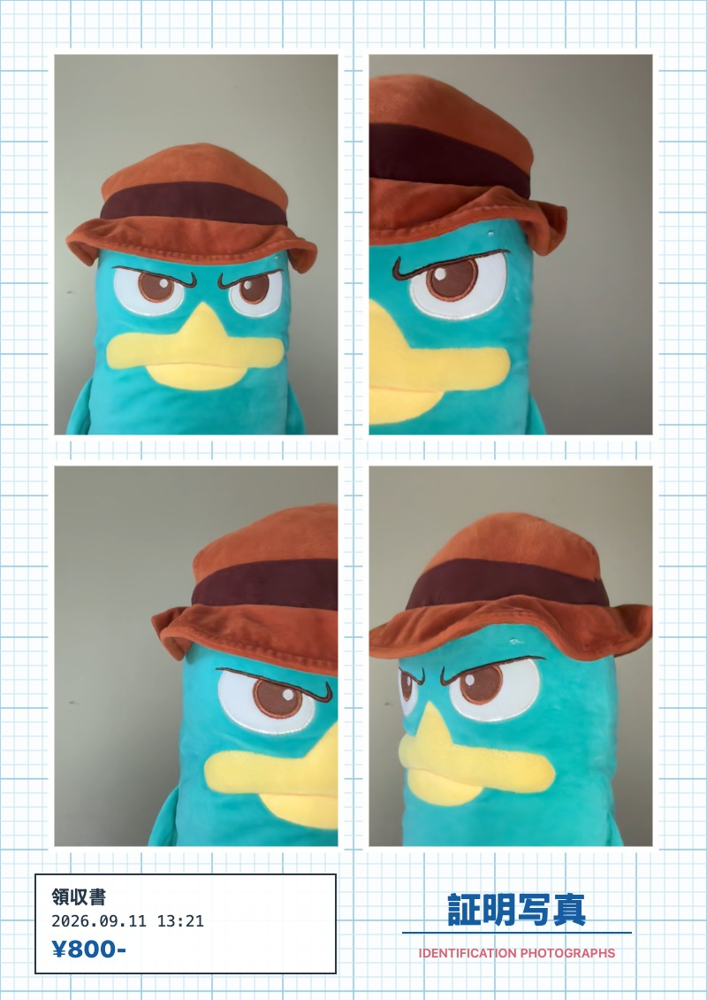
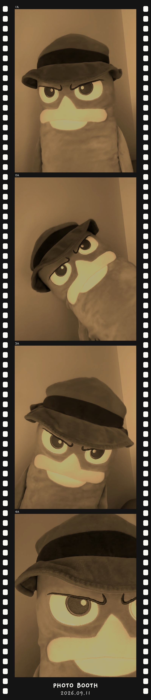

# Photo Booth

A browser photo booth with a little nostalgia: pick a frame, strike a pose, and take home a photo strip. Built with React and TypeScript for mobile and desktop.

**[Try the live demo →](https://digital-photobooth-mvp.netlify.app/#/welcome)**

No account required. Allow camera access when prompted to take your photos.

## Example Shots

<table>
  <tr>
    <th>Japanese ID</th>
    <th>Filmstrip</th>
  </tr>
  <tr>
    <td align="center" valign="top">
      
    </td>
    <td align="center" valign="top">
      
    </td>
  </tr>
</table>